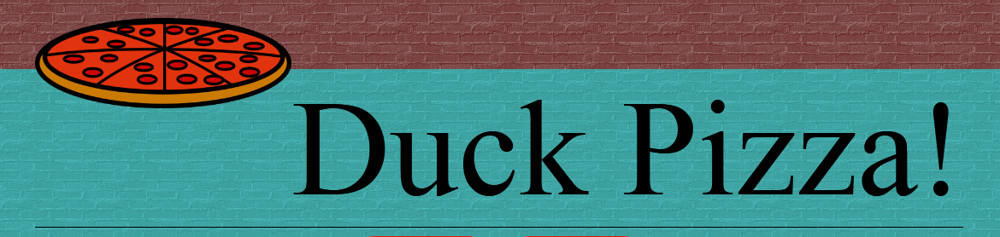
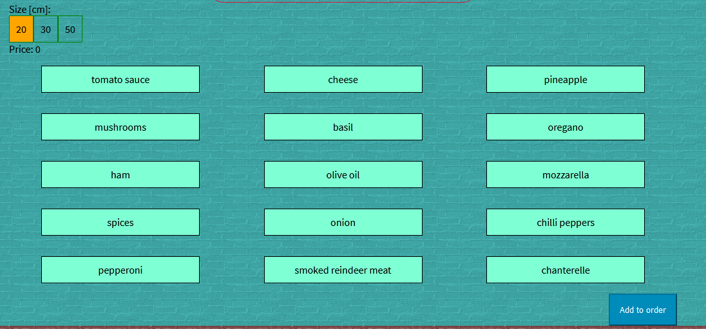
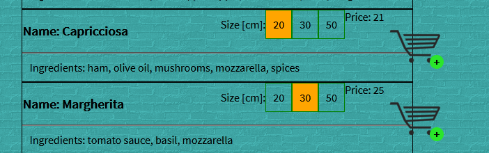
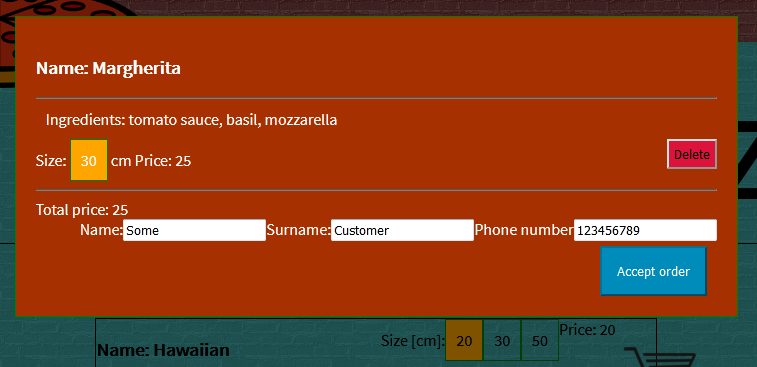
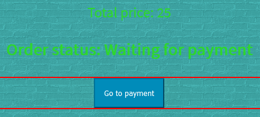
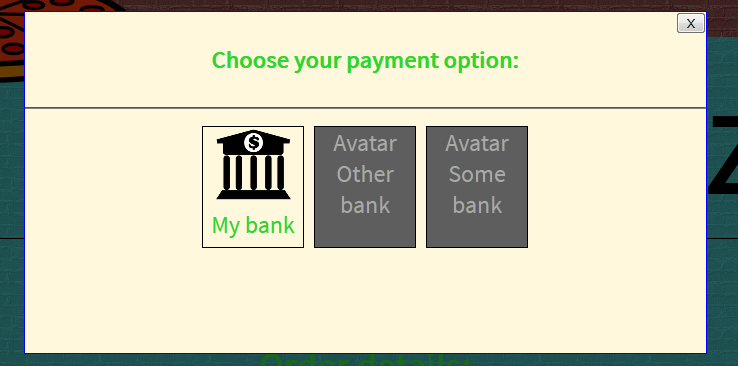
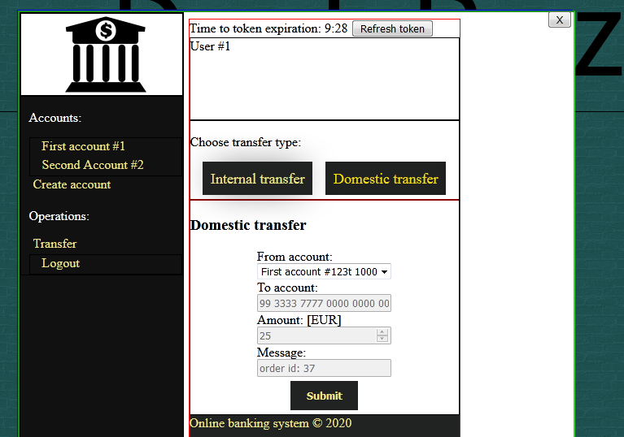
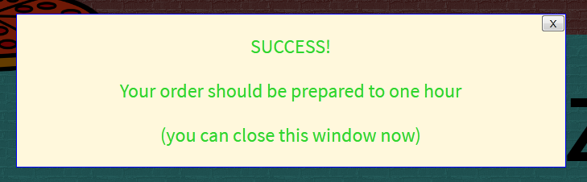

# Pizzeria-react
 GUI of [Pizzeria-spring](https://github.com/jaca1119/Pizzeria-spring)  
 Made in **React** with **React Router**

## Online [demo](https://goofy-hugle-5739c9.netlify.com/) version

## Logo

## Current development status

### :heavy_check_mark: Fetch add-ons from API
 

### :heavy_check_mark: Show menu

### :heavy_check_mark: Cart

### :heavy_check_mark: Order

### :heavy_check_mark: Payment options

### :heavy_check_mark: Transfer

### :heavy_check_mark: Success

### :heavy_check_mark: Payment accepted

## Future development
- [x] Send custom order to server
- [x] Send order with choosen pizza from menu to server
- [x] Add shopping cart
- [x] Login
